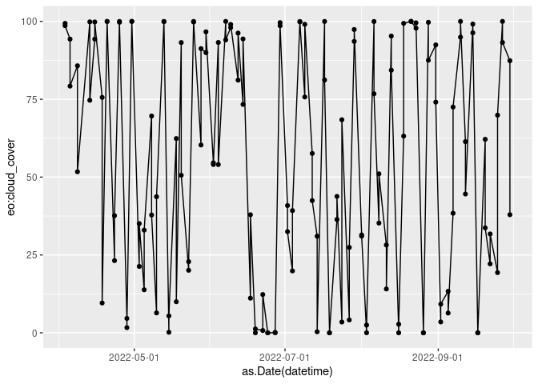
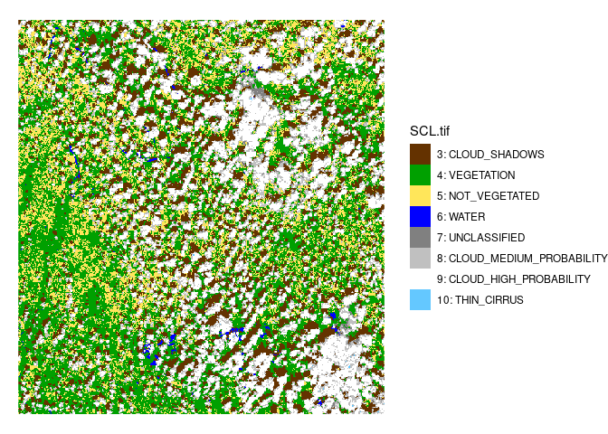

# Sentinel-2 data in R

## Accessing data via STAC APIs

The libraries we will use for this exercise are listed below.

``` r
library(dplyr) # data wrangling
library(gdalcubes) # on-demand data cubes
library(ggplot2) # plotting
library(knitr) # visualize URLs
library(osmdata) # retrieving OSM data, AOI bounding box
library(rstac) # connecting to the STAC API
library(sf) # handle geospatial data frames
library(stars) # handle spatio-temporal arrays
```

### Defining an extent

We will obtain our area of interest with the `osmdata` package.

``` r
aoi = getbb("poznan poland", format_out = "sf_polygon")
```

We can make sure the AOI is correct (run cell on source .qmd)

``` r
mapview::mapview(aoi)
```

And lastly the time extent:

``` r
time_extent = c("2022-04-01", "2022-10-01")
```

We compute the bounding box both in EPSG:4326 and EPSG:3857.

``` r
bb4326 = st_bbox(aoi)
bb3857 = aoi |> 
  st_transform(3857) |> 
  st_bbox()
```

### Querying data with `rstac`

Similarly to the `pystac-client` in Python, with
[`rstac`](https://brazil-data-cube.github.io/rstac/index.html) we define
our STAC API URL, from where we can query the collections available.

Let’s stay with the earth-search API.

``` r
s = stac("https://earth-search.aws.element84.com/v0")
collections(s) |> get_request()
```

    ###STACCollectionList
    - collections (4 item(s)):
      - sentinel-s2-l2a
      - sentinel-s2-l1c
      - sentinel-s2-l2a-cogs
      - landsat-8-l1-c1
    - field(s): collections, links

To search for the data we will refer to the parameters we defined during
the extent definition.

``` r
items = s  |> 
    stac_search(
      collections = "sentinel-s2-l2a-cogs",
      bbox = c(
        bb4326["xmin"], bb4326["ymin"], 
        bb4326["xmax"], bb4326["ymax"]
      ), 
      datetime = paste0(time_extent, collapse = "/"),
      limit = 500
    ) |> 
    post_request() 

items
```

    ###STACItemCollection
    - matched feature(s): 144
    - features (144 item(s) / 0 not fetched):
      - S2B_33UXT_20220930_0_L2A
      - S2B_33UXU_20220930_0_L2A
      - S2B_33UXT_20220927_0_L2A
      - S2B_33UXU_20220927_0_L2A
      - S2A_33UXT_20220925_0_L2A
      - S2A_33UXU_20220925_0_L2A
      - S2A_33UXT_20220922_0_L2A
      - S2A_33UXU_20220922_0_L2A
      - S2B_33UXT_20220920_0_L2A
      - S2B_33UXU_20220920_0_L2A
      - ... with 134 more feature(s).
    - assets: 
    AOT, B01, B02, B03, B04, B05, B06, B07, B08, B09, B11, B12, B8A, info, metadata, overview, SCL, thumbnail, visual, WVP
    - item's fields: 
    assets, bbox, collection, geometry, id, links, properties, stac_extensions, stac_version, type

<div>

> **Quiz**
>
> Can you spot the difference between the search exercise with Python
> and R?

</div>

We can explore the items as `sf` objects:

``` r
(i = items_as_sf(items))
```

    Simple feature collection with 144 features and 19 fields
    Geometry type: POLYGON
    Dimension:     XY
    Bounding box:  xmin: 16.43614 ymin: 51.32453 xmax: 18.14175 ymax: 53.2402
    Geodetic CRS:  WGS 84
    First 10 features:
       sentinel:sequence sentinel:latitude_band sentinel:data_coverage
    1                  0                      U                  12.48
    2                  0                      U                  39.62
    3                  0                      U                 100.00
    4                  0                      U                 100.00
    5                  0                      U                  13.01
    6                  0                      U                  40.19
    7                  0                      U                 100.00
    8                  0                      U                 100.00
    9                  0                      U                  12.47
    10                 0                      U                  39.61
                             geometry sentinel:grid_square sentinel:utm_zone
    1  POLYGON ((16.43889 51.4423,...                   XT                33
    2  POLYGON ((16.86367 52.24928...                   XU                33
    3  POLYGON ((18.01124 51.32453...                   XT                33
    4  POLYGON ((18.07166 52.22258...                   XU                33
    5  POLYGON ((16.43826 51.42235...                   XT                33
    6  POLYGON ((16.87243 52.24914...                   XU                33
    7  POLYGON ((18.01124 51.32453...                   XT                33
    8  POLYGON ((18.07166 52.22258...                   XU                33
    9  POLYGON ((16.43891 51.44284...                   XT                33
    10 POLYGON ((16.86331 52.24929...                   XU                33
                                                sentinel:product_id proj:epsg
    1  S2B_MSIL2A_20220930T100729_N0400_R022_T33UXT_20220930T130034     32633
    2  S2B_MSIL2A_20220930T100729_N0400_R022_T33UXU_20220930T130034     32633
    3  S2B_MSIL2A_20220927T100029_N0400_R122_T33UXT_20220927T124321     32633
    4  S2B_MSIL2A_20220927T100029_N0400_R122_T33UXU_20220927T124321     32633
    5  S2A_MSIL2A_20220925T101031_N0400_R022_T33UXT_20220925T162525     32633
    6  S2A_MSIL2A_20220925T101031_N0400_R022_T33UXU_20220925T162525     32633
    7  S2A_MSIL2A_20220922T100031_N0400_R122_T33UXT_20220922T174559     32633
    8  S2A_MSIL2A_20220922T100031_N0400_R122_T33UXU_20220922T174559     32633
    9  S2B_MSIL2A_20220920T100649_N0400_R022_T33UXT_20220921T213031     32633
    10 S2B_MSIL2A_20220920T100649_N0400_R022_T33UXU_20220921T213031     32633
          platform view:off_nadir gsd instruments constellation
    1  sentinel-2b              0  10         msi    sentinel-2
    2  sentinel-2b              0  10         msi    sentinel-2
    3  sentinel-2b              0  10         msi    sentinel-2
    4  sentinel-2b              0  10         msi    sentinel-2
    5  sentinel-2a              0  10         msi    sentinel-2
    6  sentinel-2a              0  10         msi    sentinel-2
    7  sentinel-2a              0  10         msi    sentinel-2
    8  sentinel-2a              0  10         msi    sentinel-2
    9  sentinel-2b              0  10         msi    sentinel-2
    10 sentinel-2b              0  10         msi    sentinel-2
                   datetime eo:cloud_cover sentinel:valid_cloud_cover
    1  2022-09-30T10:16:11Z          87.39                          1
    2  2022-09-30T10:15:59Z          37.93                          1
    3  2022-09-27T10:06:18Z         100.00                          1
    4  2022-09-27T10:06:03Z          93.24                          1
    5  2022-09-25T10:16:19Z          19.33                          1
    6  2022-09-25T10:16:07Z          69.90                          1
    7  2022-09-22T10:06:25Z          22.14                          1
    8  2022-09-22T10:06:10Z          31.74                          1
    9  2022-09-20T10:16:13Z          62.14                          1
    10 2022-09-20T10:16:01Z          33.71                          1
       sentinel:boa_offset_applied sentinel:processing_baseline
    1                         TRUE                        04.00
    2                         TRUE                        04.00
    3                         TRUE                        04.00
    4                         TRUE                        04.00
    5                         TRUE                        04.00
    6                         TRUE                        04.00
    7                         TRUE                        04.00
    8                         TRUE                        04.00
    9                         TRUE                        04.00
    10                        TRUE                        04.00
                        created                  updated
    1  2022-09-30T17:59:19.570Z 2022-09-30T17:59:19.570Z
    2  2022-09-30T18:05:38.516Z 2022-09-30T18:05:38.516Z
    3  2022-09-28T07:06:42.603Z 2022-09-28T07:06:42.603Z
    4  2022-09-28T07:38:48.100Z 2022-09-28T07:38:48.100Z
    5  2022-09-25T19:09:22.594Z 2022-09-25T19:09:22.594Z
    6  2022-09-25T20:03:57.834Z 2022-09-25T20:03:57.834Z
    7  2022-09-22T20:30:42.817Z 2022-09-22T20:30:42.817Z
    8  2022-09-22T20:29:38.768Z 2022-09-22T20:29:38.768Z
    9  2022-09-22T21:42:12.557Z 2022-09-22T21:42:12.557Z
    10 2022-09-22T21:12:58.018Z 2022-09-22T21:12:58.018Z

And easily view the cloud cover for the area:

``` r
ggplot(i) +
  aes(x = as.Date(datetime), y = `eo:cloud_cover`) +
  geom_point() +
  geom_line(group = 1) +
  scale_x_date(date_breaks = "2 months")
```



The item properties can prove useful to filter the data collection we
just obtained.

Let’s take a look at the properties present.

``` r
items$features[[1]]$properties
```

    $datetime
    [1] "2022-09-30T10:16:11Z"

    $platform
    [1] "sentinel-2b"

    $constellation
    [1] "sentinel-2"

    $instruments
    [1] "msi"

    $gsd
    [1] 10

    $`view:off_nadir`
    [1] 0

    $`proj:epsg`
    [1] 32633

    $`sentinel:utm_zone`
    [1] 33

    $`sentinel:latitude_band`
    [1] "U"

    $`sentinel:grid_square`
    [1] "XT"

    $`sentinel:sequence`
    [1] "0"

    $`sentinel:product_id`
    [1] "S2B_MSIL2A_20220930T100729_N0400_R022_T33UXT_20220930T130034"

    $`sentinel:data_coverage`
    [1] 12.48

    $`eo:cloud_cover`
    [1] 87.39

    $`sentinel:valid_cloud_cover`
    [1] TRUE

    $`sentinel:processing_baseline`
    [1] "04.00"

    $`sentinel:boa_offset_applied`
    [1] TRUE

    $created
    [1] "2022-09-30T17:59:19.570Z"

    $updated
    [1] "2022-09-30T17:59:19.570Z"

We already explored the `eo:cloud_cover` property, but there are other
properties that might turn out useful, e.g. `sentinel:valid_cloud_cover`
and `sentinel:data_coverage`.

We can filter the sf object we created before for this values and select
the first item from our result.

``` r
ids = i |> 
  mutate(fid = row_number()) |> 
  filter(
    `sentinel:valid_cloud_cover` == 1, 
    `sentinel:data_coverage` >= 80,
    `eo:cloud_cover` == min(`eo:cloud_cover`)
  ) |> 
  pull(fid)
item = items$features[[ids[1]]]
```

We can take a look at a preview of one item by getting the URL of the
*thumbnail* asset. Note that `rstac` has a
[`preview_plot`](https://brazil-data-cube.github.io/rstac/reference/preview_plot.html)
function but it does not accept JPG formats yet.

``` r
item |> 
  assets_url(asset_names = "thumbnail") |> 
  include_graphics()
```


### Creating a STAC data cube

Once we have made our query and fetched the data, we can create an
on-demand data cube with [`gdalcubes`](https://gdalcubes.github.io/).

We can filter the times collection with the `property_filter` parameter.
As we saw before we will keep only scenes with valid cloud cover values
below 10%.

``` r
assets = c(
  "B01","B02","B03","B04","B05","B06",
  "B07","B08","B8A","B09","B11","SCL"
)
col = stac_image_collection(
  items$features,
  asset_names = assets,
  property_filter = function(x) {x[["eo:cloud_cover"]] < 10 & x[['sentinel:valid_cloud_cover']]}
)
```

    Warning in stac_image_collection(items$features, asset_names = assets,
    property_filter = function(x) {: STAC asset with name 'SCL' does not include
    eo:bands metadata and will be considered as a single band source

``` r
col
```

    Image collection object, referencing 28 images with 12 bands
    Images:
                          name     left      top   bottom    right
    1 S2A_33UXU_20220905_0_L2A 16.46503 53.24020 52.24938 17.38807
    2 S2A_33UXT_20220902_0_L2A 16.43614 52.34135 51.32453 18.07774
    3 S2A_33UXU_20220902_0_L2A 16.46499 53.24020 52.22257 18.14175
    4 S2A_33UXT_20220826_0_L2A 16.43919 52.34135 51.45200 16.90558
    5 S2A_33UXU_20220826_0_L2A 16.46503 53.24020 52.24934 17.39166
    6 S2A_33UXT_20220816_0_L2A 16.43906 52.34135 51.44769 16.90734
                 datetime        srs
    1 2022-09-05T10:16:11 EPSG:32633
    2 2022-09-02T10:06:30 EPSG:32633
    3 2022-09-02T10:06:15 EPSG:32633
    4 2022-08-26T10:16:24 EPSG:32633
    5 2022-08-26T10:16:12 EPSG:32633
    6 2022-08-16T10:16:24 EPSG:32633
    [ omitted 22 images ] 

    Bands:
       name offset scale unit nodata image_count
    1   B01      0     1                      28
    2   B02      0     1                      28
    3   B03      0     1                      28
    4   B04      0     1                      28
    5   B05      0     1                      28
    6   B06      0     1                      28
    7   B07      0     1                      28
    8   B08      0     1                      28
    9   B09      0     1                      28
    10  B11      0     1                      28
    11  B8A      0     1                      28
    12  SCL      0     1                      28

### Visualizing the data

To view the data, we create a `cube_view()` object considering the AOI
defined before *but with EPSG:3857*.

Arguments `dx` and `dy` define the spatial resolution of our output,
while `dt` corresponds to the temporal resolution.

<div>

> **Quiz**
>
> How would you define a biweekly temporal interval? Hint
> `?cube_view()`.

</div>

``` r
v = cube_view(
  srs = "EPSG:3857",  
  extent = list(t0 = time_extent[1],
                t1 = time_extent[2],
                left = bb3857["xmin"],
                bottom = bb3857["ymin"], 
                right = bb3857["xmax"],
                top = bb3857["ymax"]),
  dx = 200, dy = 200, dt = "P1D",
  aggregation = "median",
  resampling = "average"
)
```

A cloud mask can also be defined. This will be based on the SCL values.

For that let’s first expand on
[SCL](https://sentinels.copernicus.eu/web/sentinel/technical-guides/sentinel-2-msi/level-2a/algorithm-overview),
which is the result of the Sentinel-2 scene classification.

We will use the `stars` package to visualize the layer. But first we
let’s select an item with moderate cloud cover to have an idea of the
values present.

``` r
ids = i |> 
  mutate(fid = row_number()) |> 
  filter(
    `sentinel:valid_cloud_cover` == 1, 
    `sentinel:data_coverage` >= 90,
    `eo:cloud_cover` <= 50
  ) |> 
  pull(fid)
item = items$features[[ids[1]]]

scl_ex = item |> 
  assets_url(asset_names = "SCL", append_gdalvsi = TRUE) |>
  read_stars(RasterIO = list(nBufXSize = 512, nBufYSize = 512))
```

In the data folder of this repo I added a CSV file with the SCL classes
that we will use for plotting.

``` r
scl = read.csv("../../data/SCL_classes.csv")
scl = scl |> 
  mutate(label = paste(code, desc, sep = ": "))
scl_pal = scl$color
names(scl_pal) = scl$label
scl_ex_factor = scl_ex |> 
  mutate(
      SCL.tif = factor(SCL.tif, levels = scl$code, labels = scl$label)
    )
ggplot() +
  geom_stars(data = scl_ex_factor) +
  scale_fill_manual(values = scl_pal) +
  theme_void()
```



We can then see that masking out clouds would require to reference
classes 3, 8 and 9.

``` r
# clouds and cloud shadows
S2.mask = image_mask("SCL", values=c(3,8,9)) 
```

Finally, we can visualize a median composite of our collection. This
particular chunk will take a while since the data is fetched from the
cloud before plotting. For this reason we include the
`gdalcubes_options(parallel = 4)` line which would use any parallel
processing available in your system. We will run this code chunk
interactively.

``` r
gdalcubes_options(parallel = 4) 
raster_cube(col, v, mask = S2.mask) |> 
    select_bands(c("B02","B03","B04")) |> 
    reduce_time(c("median(B02)", "median(B03)", "median(B04)")) |> 
    plot(rgb = 3:1, zlim=c(0,1800)) 
```

### Downloading data

Nowadays, there is a lot that can be done to process data on the cloud.
However, if you still need to download datasets, `rstac` will have you
covered with the `assets_download()` function. This will download all of
the items from your search, so make sure you apply enough filtering so
that you don’t download data that you don’t need. [More info on the
function can be found on the package
documentation](https://brazil-data-cube.github.io/rstac/reference/assets_functions.html).
